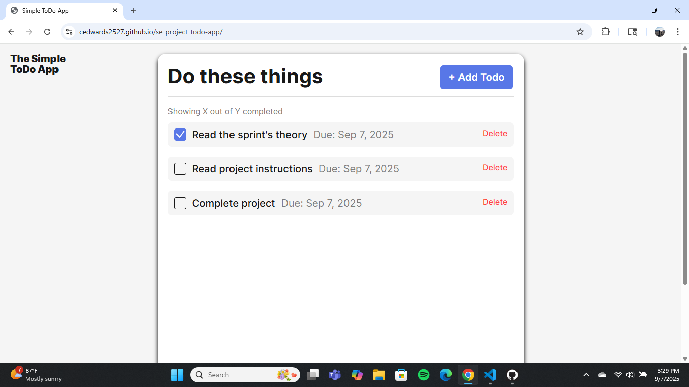
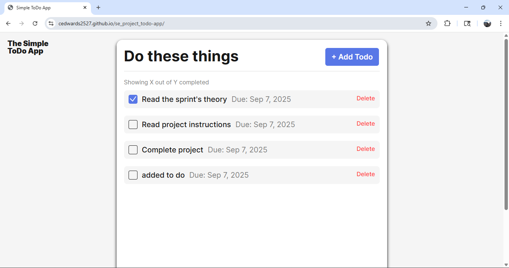

# Todo App

A simple, modern ToDo application built with JavaScript, HTML, and CSS. This will help manage your daily tasks with a clean and responsive interface.

## Functionality

Add new todos with a name and optional due date
Mark todos as completed
Delete todos
View a count of completed and total todos
Responsive design for desktop and mobile
Form validation with instant feedback

## Technology

HTML5,
CSS (BEM methodology)
JavaScript (ES6+)
Modular file structure

## Screenshots

## Deployment

This project is deployed on GitHub Pages:
https://cedwards2527.github.io/se_project_todo-app/
